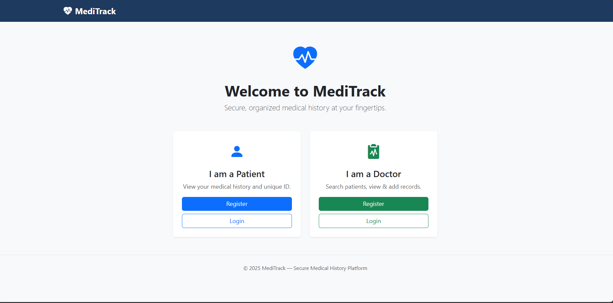
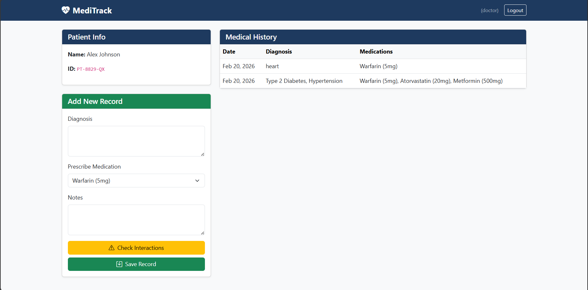
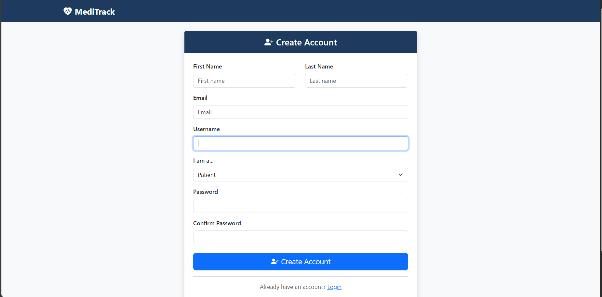

<p align="center">
  
</p>

# MediTrack🏥

## Basic Details

### Team Name: Hakuna Matata

### Team Members
- Member 1: Judith Susan Soney - Sree Buddha College of Engineering
- Member 2: Diya Thresia Daniel - Sree Buddha College of Engineering

### Hosted Project Link
[\[mention your project hosted link here\]](https://meditrack-qaf6.onrender.com/)

### Project Description
The project is a Django-based medical history tracking web app with doctor and patient logins. It shows patient medical records and allows doctors to add consultations with a drug interaction checker, deployed on Render.

### The Problem statement
**Patients often carry physical files or rely on memory to share their medical history with doctors, leading to incomplete records, missed drug interactions, and delayed treatment.**

MediTrack solves this by giving every patient a unique digital ID that instantly pulls their full medical history — diagnoses, prescriptions, allergies — for any doctor to access and update in real time, with built-in drug interaction alerts to prevent dangerous prescription errors.

### The Solution
MediTrack is a web-based medical history platform where patients get a unique ID that stores their complete health record digitally. Doctors can instantly look up any patient by ID, view their full history, add consultation notes, and prescribe medications — with an automated Drug-Drug Interaction checker that flags dangerous combinations before they reach the patient.

## Technical Details

### Technologies/Components Used
*Backend*
- Python
- Django 

*Database*
- SQLite (development)

*Deployment*
- Render

## Features
- Unique ID system for patients
- Role-based dashboard (Doctor / Patient)
- Medical history tracking
- Prescription entry interface
- Drug interaction warning system
- Production-ready configuration for deployment

---

## Implementation

### Installation

1. Clone the repository
```bash
   git clone <repository-link>
   cd Vita-Record
```

2. Create and activate virtual environment
```bash
   python -m venv venv
   venv\Scripts\activate
```

3. Install dependencies
```bash
   pip install -r requirements.txt
```

4. Run database migrations
```bash
   python manage.py migrate
```

5. Create preset users (doctor + patient)
```bash
   python manage.py create_preset_users
```

### Run
```bash
python manage.py runserver
```

Then open `http://127.0.0.1:8000` in your browser.

**Demo credentials:**

- Patient → username : patient / password : 123
- Doctor → username : doctor/ password : 123
## Project Documentation

### For Software:

#### Screenshots (Add at least 3)


*LANDING PAGE OF THE WESITE*


*DOCTORS DASHBOARD IN WEBSITE*


*PATIENTS DASHBOARD IN WEBSITE*


*SIGNUP PAGE *


*LOGIN PAGE*
## Project Demo

### Video
[[Add your demo video link here - YouTube, Google Drive, etc.](https://drive.google.com/drive/folders/1djgYzY2Ok_U8UMoFY1pxaFbsnaq1x-Na?usp=sharing)]

*Explain what the video demonstrates - key features, user flow, technical highlights*

---

## Team Contributions

- Diya Thresia Daniel: Collabed with Judith Suan Soney
- Judith Suan Soney : Collabed with Diya Thresia Daniel

---

## License
MIT License

Copyright (c) 2026 <Diya Thresia Daniel>

Permission is hereby granted, free of charge, to any person obtaining a copy
of this software and associated documentation files (the "Software"), to deal
in the Software without restriction, including without limitation the rights
to use, copy, modify, merge, publish, distribute, sublicense, and/or sell
copies of the Software, and to permit persons to whom the Software is
furnished to do so, subject to the following conditions:

The above copyright notice and this permission notice shall be included in all
copies or substantial portions of the Software.

THE SOFTWARE IS PROVIDED "AS IS", WITHOUT WARRANTY OF ANY KIND, EXPRESS OR
IMPLIED, INCLUDING BUT NOT LIMITED TO THE WARRANTIES OF MERCHANTABILITY,
FITNESS FOR A PARTICULAR PURPOSE AND NONINFRINGEMENT. IN NO EVENT SHALL THE
AUTHORS OR COPYRIGHT HOLDERS BE LIABLE FOR ANY CLAIM, DAMAGES OR OTHER
LIABILITY, WHETHER IN AN ACTION OF CONTRACT, TORT OR OTHERWISE, ARISING FROM,
OUT OF OR IN CONNECTION WITH THE SOFTWARE OR THE USE OR OTHER DEALINGS IN THE
SOFTWARE.

---

Made with ❤️ at TinkerHub